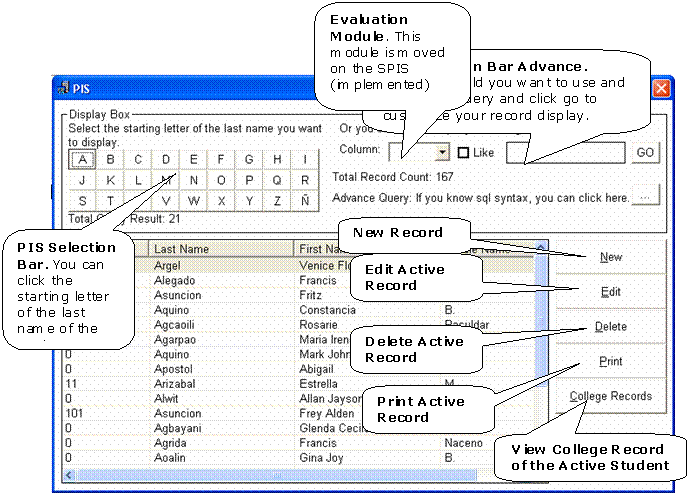



## A complete Information and Student Evaluation System\!

### Description

This is a complete application which handles student subject records, curricula offerings, subject offerings (i Based this program on CSU SM where i worked for a while). It can perform some report generation, evaluate students for subjects to take. Still under development, please wait for updates
 
### More Info
 

             |
---                |---
**Submitted On**   |2005-05-06 09:32:46
**By**             |[jheikage](https://github.com/Planet-Source-Code/PSCIndex/blob/master/ByAuthor/jheikage.md)
**Level**          |Advanced
**User Rating**    |4.5 (27 globes from 6 users)
**Compatibility**  |VB 6\.0
**Category**       |[Complete Applications](https://github.com/Planet-Source-Code/PSCIndex/blob/master/ByCategory/complete-applications__1-27.md)
**World**          |[Visual Basic](https://github.com/Planet-Source-Code/PSCIndex/blob/master/ByWorld/visual-basic.md)
**Archive File**   |[A\_complete188584582005\.zip](https://github.com/Planet-Source-Code/jheikage-a-complete-information-and-student-evaluation-system__1-60426/archive/master.zip)

